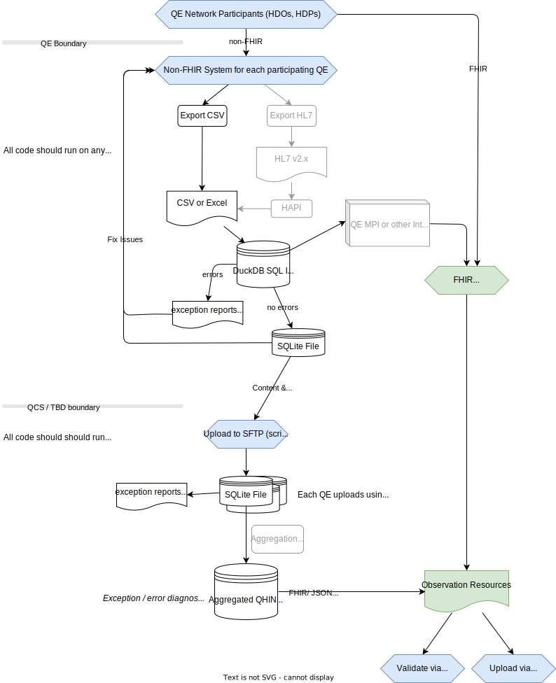

# QCS Ingestion Center (QCS-IC) Strategy

The objective of QCS-IC is to get from ingestable content in CSV, Excel, and
similar formats into a SQL-queryable analyst-friendly format as quickly as
possible. Once content is SQL-queryable and analyst-friendly it can be enriched,
cleansed, validated, transformed, and pushed to other formats such as FHIR
(JSON).

To facilitate quickly getting ingestable content into a SQL-queryable
analyst-friendly format, QCS-IC employs the following architecture strategy:

- SQL-native encourages performing work inside a DuckDB database as early as
  possible in the ingestion process but all ingested resources can be exported
  into SQLite, MySQL, PostgreSQL, AWS Cloud, Azure Cloud, or other databases for
  portability.
  - All ingestion is done using a relational database (DuckDB).
  - Some structural validation is done using Typescript (e.g. validating sheets
    in an Excel workbook).
  - Most structural validation is done using SQL (e.g. checking column names)
  - All content validation is done using SQL (using CTEs).
  - All content enrichment can be done using SQL whenever possible using CTEs
    but can fallback to TypeScript for anything that cannot be accomplished in
    SQL.
  - All content cleansing can be done using SQL whenever possible using CTEs but
    can fallback to TypeScript for anything too complex for SQL.
  - All content transformations can be done using SQL (using CTEs).
  - All error reporting is done using a database (for machine consumption) or
    Excel (for human consumption).
  - All business reporting is done directly from within the DuckDB database or
    exported to SQLite for easy integration into other systems.
- Flexible support for local, edge, server, cloud or hybrid models. No code
  changes should be required regardless of which deployment model is chosen.
  - _Local_ allows development on a laptop or any Windows, MacOS, or Linux
    desktop
  - _Edge_ allows services to run within a QE for parts or all of the
    functionality
  - _Server_ allows services to run partially or entirely at a QCS facility in
    case a QE does not want or have the capability to run services _locally_ or
    on the _edge_.
  - _Cloud_ allows services to run partially or entirely in a public or private
    cloud provider (e.g. AWS, Azure, ORACLE Cloud).
- Automatic upgrades of code using `semver` and GitHub tags.

## Dependencies

- Download
  [Deno](https://docs.deno.com/runtime/manual/getting_started/installation)
  Javascript runtime and put it in your `PATH`.
- Download [DuckDB](https://duckdb.org/docs/installation) 0.9+ for ingestion
  operations and put it in your `PATH`.

The utilities mentioned above are cross-platform single-file binaries and will
run on Windows, MacOS, or Linux. Please be sure to get the proper binaries for
your platform.

## Development Tools

- Download [Visual Studio Code](https://code.visualstudio.com/download) IDE and
  use it for editing or viewing of CSV and other assets. VS Code is available
  for all major OS platforms.
- Download [SQLite](https://www.sqlite.org/download.html) embedded database and
  put it in your `PATH`.

## Try out the code

You can run the code directly from GitHub (the latest version or any specific
pinned version) without cloning the GitHub repo or clone the repo and run the
code locally.

```bash
$ git clone https://github.com/qe-collaborative-services/1115-hub
$ cd 1115-hub
$ deno task                               # list available tasks in `deno.jsonc`
$ deno task doctor                        # see if dependencies are installed properly
$ deno task ahc-hrsn-screening-test-e2e   # run the ingestion tasks as end-to-end test
$ deno task ahc-hrsn-screening-doc        # generate documentation for the library in support/docs/lib/ahc-hrsn-elt/screening
```

## Architecture and Approach

TODO: narratives and explanations


