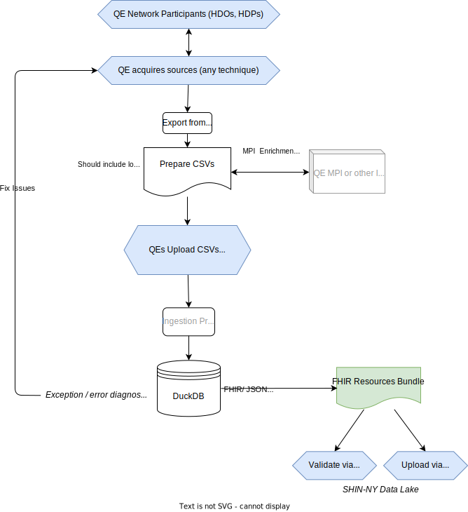

# QCS Orchestration Engine (QCS-OE) Strategy

The objective of QCS-OE is to get from ingestable content in CSV, Excel, and
similar formats into a SQL-queryable analyst-friendly format as quickly as
possible. Once content is SQL-queryable and analyst-friendly it can be
anonymized, enriched, cleansed, validated, transformed, and pushed to other
formats such as FHIR (JSON).

To facilitate quickly getting ingestable content into a SQL-queryable
analyst-friendly format, QCS-OE employs the following architecture strategy:

- SQL-native encourages performing work inside a DuckDB database as early as
  possible in the ingestion process but all orchestrated resources can be
  exported into SQLite, MySQL, PostgreSQL (bare metal or serverless like RDS),
  AWS Cloud, Azure Cloud, or other databases for portability.
- A TypeScript type-safe Runtime (Deno) is used to drive the DuckDB SQL and uses
  OS-specific execution of DuckDB Shell (CLI) for parallelization and
  scalability.
- Flexible support for local, edge, server, cloud or hybrid models. No code
  changes should be required regardless of which deployment model is chosen.
  - _Local_ allows development on a laptop or any Windows, MacOS, or Linux
    desktop
  - _Edge_ allows services to run within a QE for parts or all of the
    functionality
  - _Server_ allows services to run partially or entirely at a QCS facility in
    case a QE does not want or have the capability to run services _locally_ or
    on the _edge_.
  - _Cloud_ allows services to run partially or entirely in a public or private
    cloud provider (e.g. AWS, Azure, ORACLE Cloud).
- Automatic upgrades of code using `semver` and GitHub tags.

## Specifications

NYeC's specifications are available in
[support/docs/specifications/ahc-hrsn-elt/screening](support/docs/specifications/ahc-hrsn-elt/screening):

- `ahc-hrsn-2024-03-08-omnibus-rules.xlsx` contains the "Omnibus Rules" (sample
  files, external references, business rules and remarks in a single Excel
  Workbook for convenience)
- DEMOGRAPHIC_DATA_2024-02-21.csv is sample data
- QE_ADMIN_DATA_2024-02-21.csv is sample data
- SCREENING_2024-02-21.csv is sample data

## Getting Started

The following instructions are for setting up the code on a
[developer sandbox](https://en.wikipedia.org/wiki/Sandbox_(software_development))
("[dev sandbox](https://en.wikipedia.org/wiki/Sandbox_(software_development))"
or just
"[sandbox](https://en.wikipedia.org/wiki/Sandbox_(software_development))").

For dev sandboxes you should be able to use workstations or laptops that have:

- Modern i5 or i7 class CPUs (circa 2021 or later)
- 32GB RAM
- 25GB of disk space
- Windows 11 if possible (Windows 10 is a possibility, too)
- Windows Subsystem for Linux (WSL)

_Instructions for deploying to test servers or production servers will be
provided later._

### Quick start (Windows):

If you have a relatively modern Windows 10/11 system with `winget` and `scoop`
you can use "Windows Terminal (Administrator)" to install Git, Deno, DuckDB,
SQLite and VS Code IDE:

```psh
$ winget install Git.Git deno SQLite.SQLite DuckDB.cli Microsoft.VisualStudioCode
$ scoop install sqlpage
```

**IMPORTANT**: `winget` installations will update your PATH so exit your
terminal, close VS Code, etc. and restart your Windows Terminal (Administrator)
session and VS Code _before you try out the code_.

If you want a nice, easier to read, CLI prompt install and setup
[Oh My Posh](https://ohmyposh.dev/docs/installation/windows).

You can also evaluate the code in a
[Windows Sandbox](./support/docs/windows-sandbox-setup.md) environment

### Quick start (Linux or MacOS):

For Linux or MacOS use [pkgx](https://pkgx.sh/) and
[eget](https://github.com/zyedidia/eget/releases) to install dependencies. For
guidance see
[Strategy Coach Workspaces Host](https://github.com/strategy-coach/workspaces-host)
and then:

```bash
$ pkgx install sqlite.org duckdb.org
$ eget lovasoa/SQLpage --to=$HOME/.local/bin/sqlpage
```

### Dependendies Elaboration

See [support/docs/dependencies.md](support/docs/dependencies.md) if you need
further details about what the code depends on at runtime.

## Try out the code

Once you've installed Git and Deno you can run the code directly from GitHub
(the latest version or any specific pinned version) without cloning the GitHub
repo or clone the repo and run the code locally.

The instructions below assume `c:\workspaces` as your workspaces root but you
should change that to `D:\` or `/home/user/workspaces` or whatever your
workspaces root happens to be (based on your operating system).

```bash
$ md c:\workspaces                        # create the destination if required
$ cd c:\workspaces                        # or wherever your sources are stored
$ deno run -A https://raw.githubusercontent.com/qe-collaborative-services/workspaces/main/ws-bootstrap-typical.ts

# after repo cloning command (above) is complete:
$ cd github.com/qe-collaborative-services/1115-hub
$ deno task                               # list available tasks in `deno.jsonc`
$ deno task doctor                        # see if dependencies are installed properly
```

If `deno task doctor` reports dependencies are installed properly:

```bash
$ deno task ahc-hrsn-screening-test-e2e
```

Use VS Code to open the `github.com/qe-collaborative-services/1115-hub` folder
and open
`support\assurance\ahc-hrsn-elt\screening\results-test-e2e\resource.sqlite.db`
(the `SQLite3 Editor` extension, if you accepted VS Code's recommendation, will
open it).

If the above works, and you installed SQLPage, you can start a webserver, too:

```bash
$ deno task ahc-hrsn-screening-test-serve
```

## Build (Development) Dependencies

During build (development) in a sandbox you will need all the runtime
dependencies mentioned above plus do the following:

- Download [Visual Studio Code](https://code.visualstudio.com/download) IDE and
  use it for editing or viewing of CSV and other assets. VS Code is available
  for all major OS platforms.
  - Install the recommended extensions (see `.vscode/extensions.json`). VS Code
    will usually suggest those automatically.

## Architecture and Approach

This code allows multiple operating models, but these two are the most likely
use cases:

- QCS Only Model where a QE does not operate their own code instances to
  validate or manage data and relies on QCS infrastructure only.
  - Benefits: No local infrastructure required
  - Detriments: No ability to validate or analyze aggregated data before sending
    to QCS environment
- QE/QCS Model where a QE can operate their own code instances for validation
  and data management locally and then forwards processed data to the QCS
  infrastructure.
  - Benefits: Ability to validate and analyze aggregated data before sending to
    QCS environment
  - Detriments: Needs small amount of local infrastructure to operate the same
    code running at QCS

### Serverless Execution

All of the components of this repo should be able to run in a Serverless
environment like AWS Lamba. See:

- [serverless-duckdb](https://github.com/tobilg/serverless-duckdb) and
- [SQLpage serverless](https://github.com/lovasoa/SQLpage?tab=readme-ov-file#serverless).

### QCS Only Model



### QE/QCS Model


