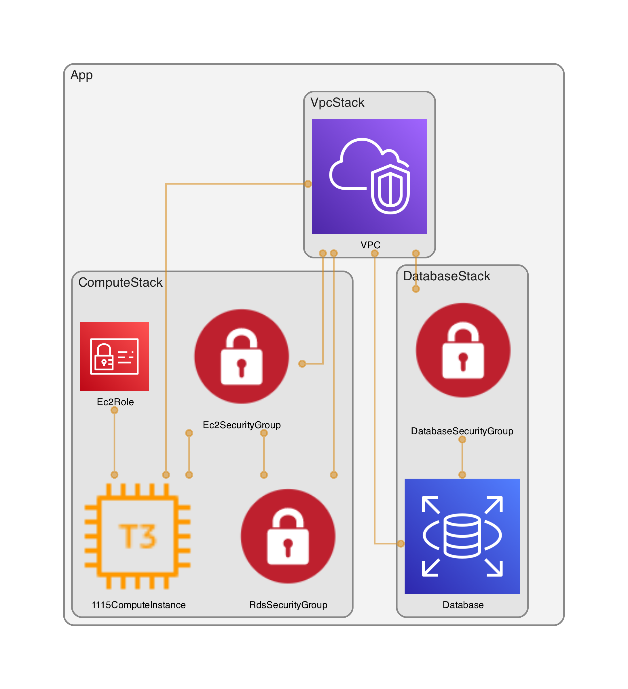

# 1115 CDK Infrastructure  
This deployment serves as a quick and simple proof of concept to deploying a usable and functional version of the 1115 system deployed to AWS using a type safe infrastructure as code tool (AWS CDK). 

This demonstrates a CDK app with 3 stacks to support 1115 core functionality:
- `VPC Stack` - VPC to contain the ec2 instance and the serverless db cluster
- `Database Stack` - contains an aurora serverless cluster configured for PostgreSQL
- `Compute Stack` - a T2 Micro EC2 Instance provisioned with Debian Bullseye and Automated Install of required libraries 

The above can be viewed with the following diagram:

